## Task Outputs

### Task 1
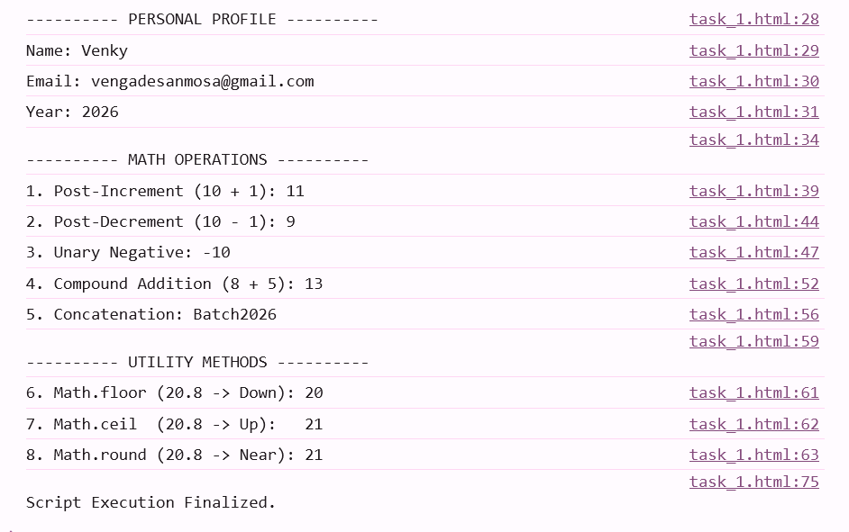

### Task 2
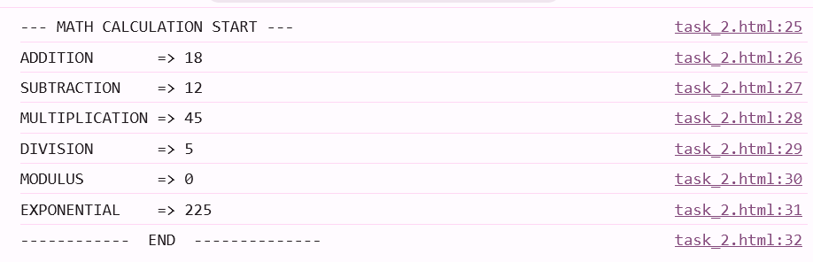

### Task 3

### Task 4
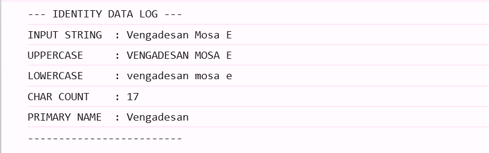

### Task 5

### Task 6

### Task 7

### Task 7 Console

### Task 8
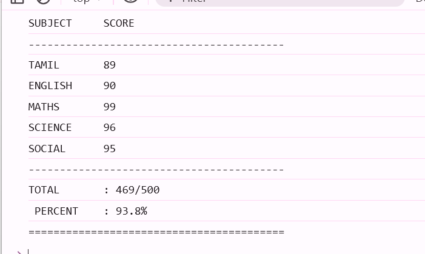

### Task 9

### Task 10
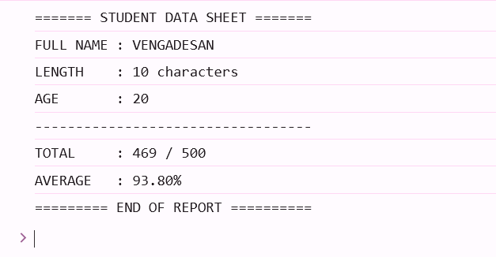
### Task 2-1
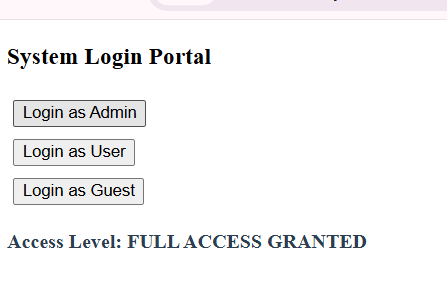

### Task 2-2

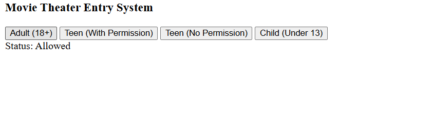
### Task 2-3
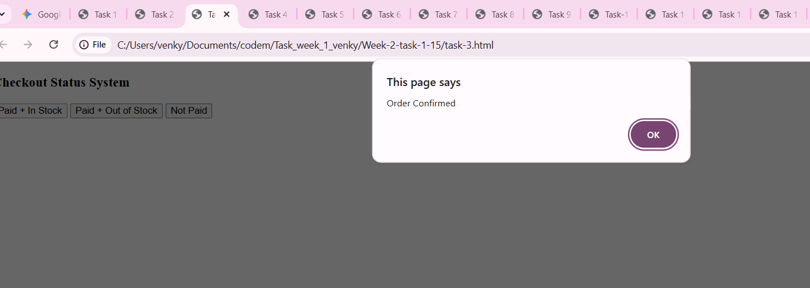
### Task 2-4

### Task 2-5
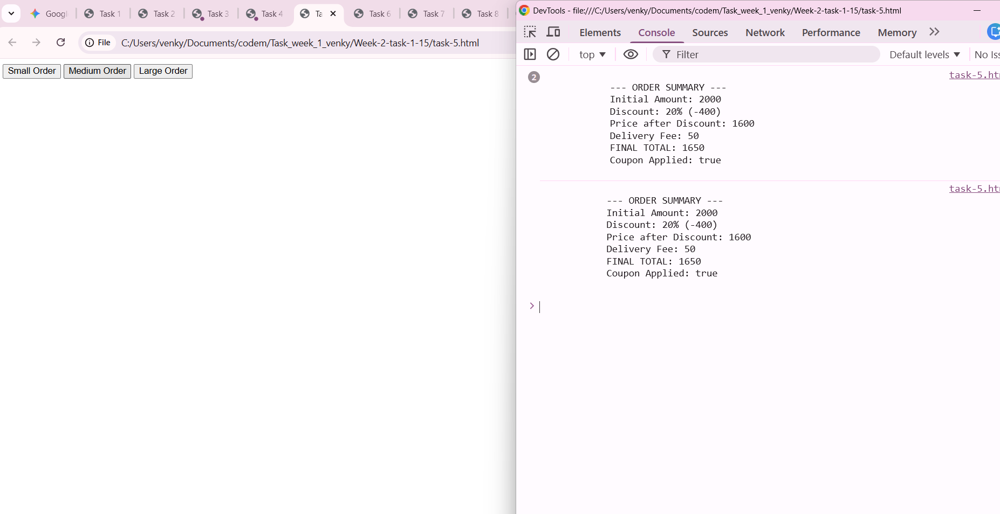

### Task 2-6
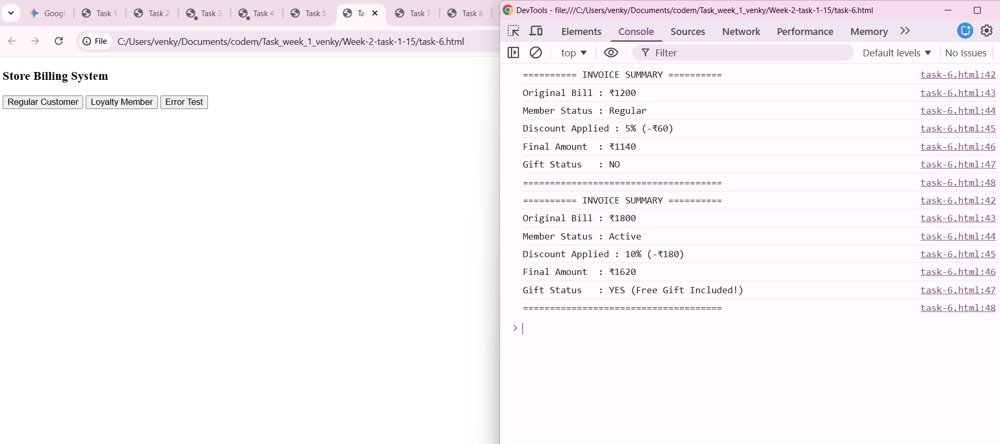
### Task 2-7
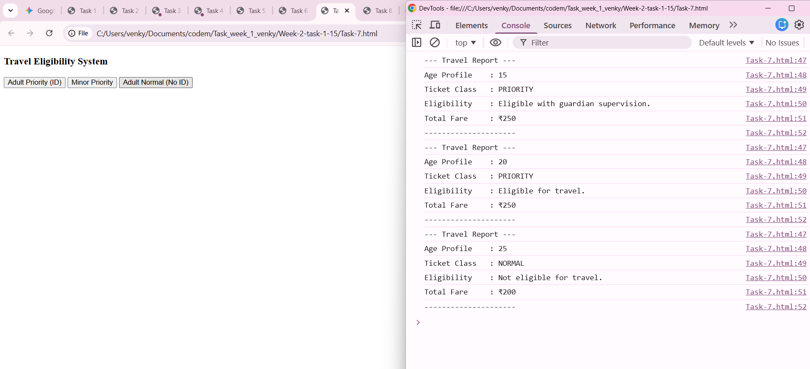
### Task 2-8
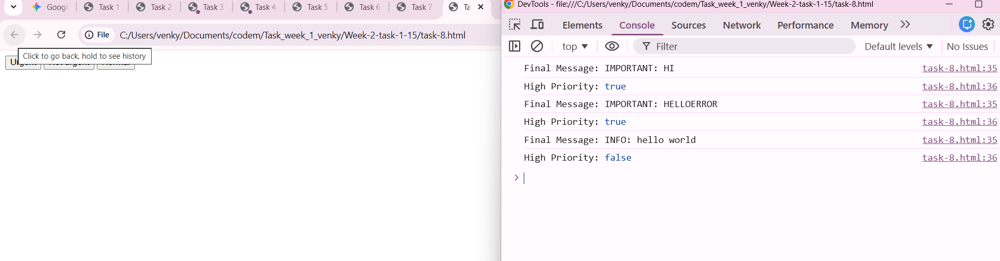
### Task 2-9

### Task 2-10
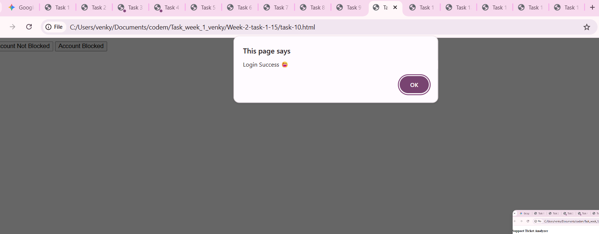
### Task 2-11
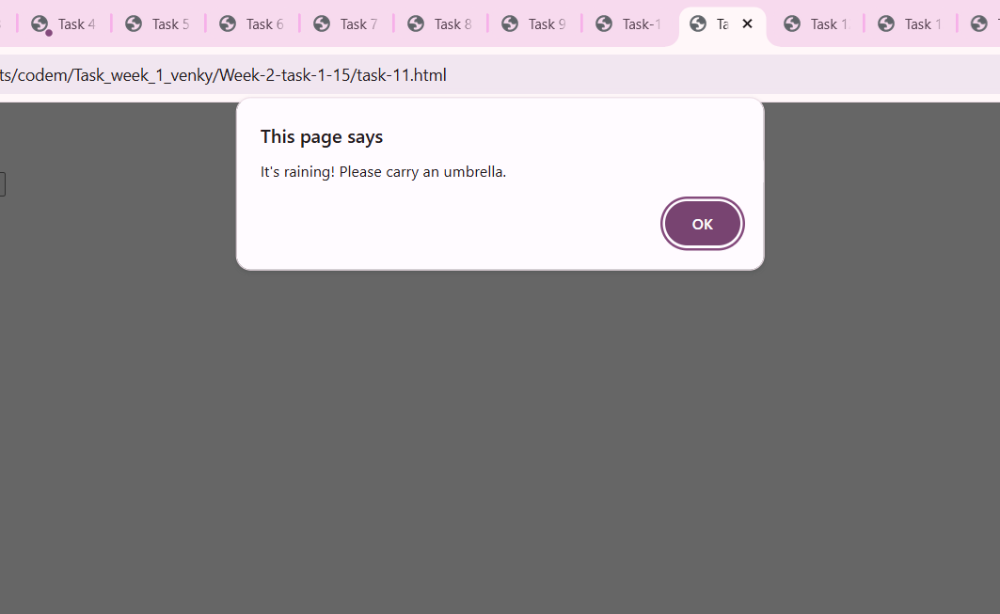
### Task 2-12

### Task 2-13
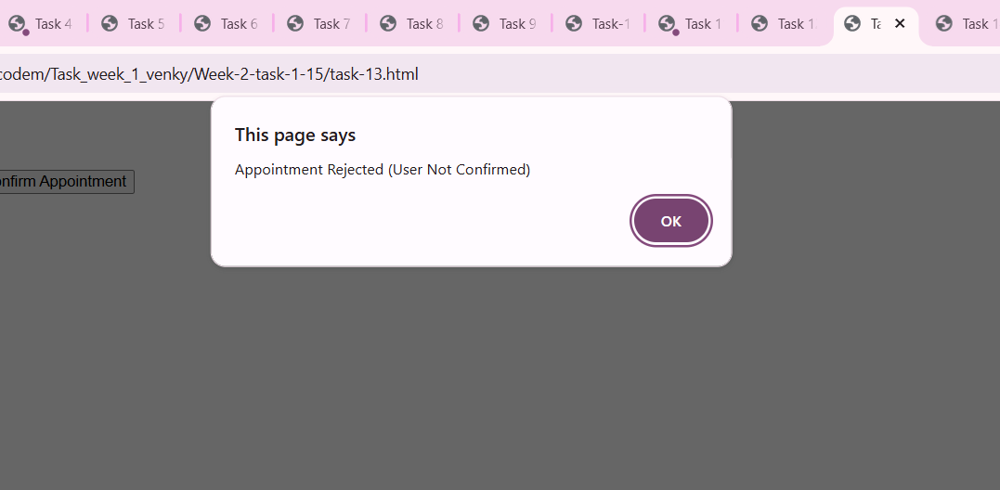
### Task 2-14
 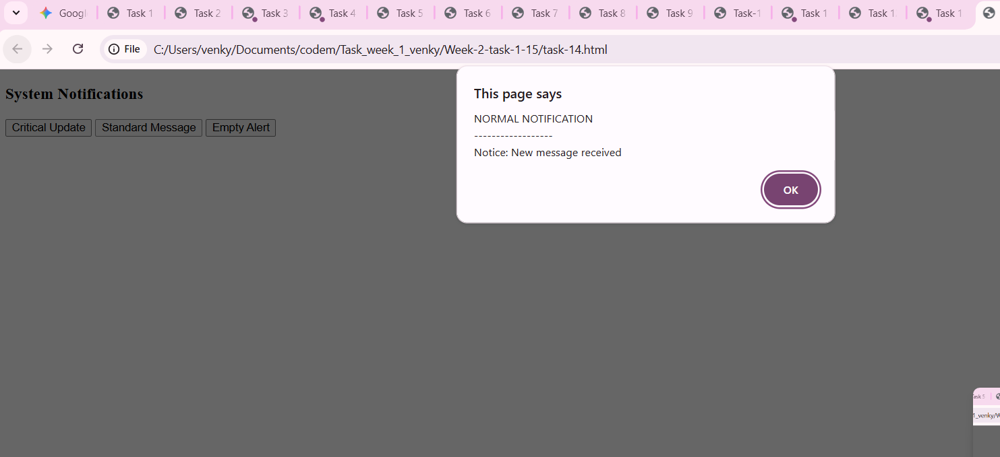

 ### Task 2-15
 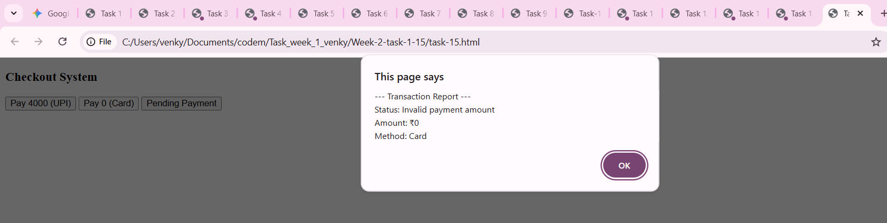